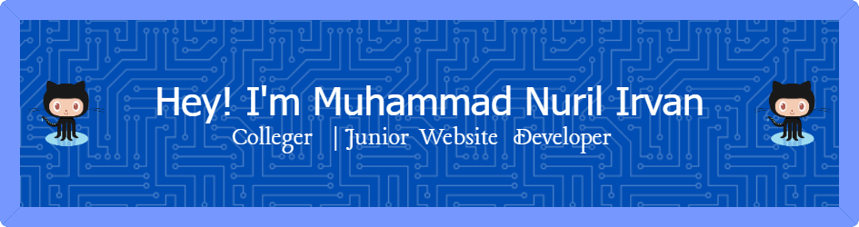

<!--
**MNIrvan/MNIrvan** is a ✨ _special_ ✨ repository because its `README.md` (this file) appears on your GitHub profile.

Here are some ideas to get you started:

- 🔭 I’m currently working on ...
- 🌱 I’m currently learning ...
- 👯 I’m looking to collaborate on ...
- 🤔 I’m looking for help with ...
- 💬 Ask me about ...
- 📫 How to reach me: ...
- 😄 Pronouns: ...
- ⚡ Fun fact: ...
-->

## 💫About Me
- 🔭 I'm a student from the Lumajang branch of the Malang State Polytechnic
- 🌱 I’m currently learning PHP and Laravel Framework
- 👯 I’m looking to collaborate on a Website Development project
- 📫 How to reach me: u can reach me through my Instagram [(**@mnirvann**)](https://instagram.com/mnirvann)
- ⚡ Fun fact: i'm like Badmintoon, chess and playing video game

## 💻What i learned & Framework | Library

         

<!--  -->

## 🌐Social

  

## 📊My Github Stats

 
 

## 🏆 GitHub Trophies

## ✍️ Random Dev Quote

## 🔝 Top Contributed Repo

  

